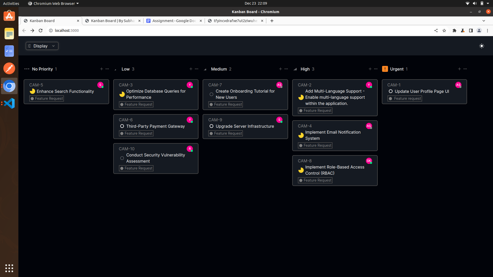

# Kanban Board Application

This repository contains a Kanban board application built using React and Next.js, interacting with an API to display and manage tickets in a Kanban board layout.

## Live Demo


A live demo of the application can be accessed [here](https://cherish-cypherx-internship-assignment.vercel.app).

## Features

- Fetches data from the provided API to display tickets in a Kanban board.
- Allows users to group tickets by Status, User, or Priority.
- Supports sorting tickets by Priority or Title.
- Saves user's view state even after page reload.
- Responsive and visually appealing UI.

## Technologies Used

- Next.js
- React
- Tailwind CSS

## Installation and Setup

1. **Clone the repository**

    ```bash
    git clone https://github.com/csachdeva83/CYPHERX-Internship_Assignment.git
    ```

2. **Install dependencies**

    ```bash
    cd CYPHERX-Internship_Assignment
    npm install
    ```

3. **Run the application**

    ```bash
    npm run dev
    ```

4. **Access the application**

    Open your browser and navigate to `http://localhost:3000`.

## Usage

- Click the "Display" button to choose a grouping option (Status, User, or Priority).
- Utilize the sorting buttons to sort tickets by Priority or Title.
- Interact with the Kanban board to view and manage tickets based on the selected options.


## Screenshots



## Hosting

The application is hosted at Vercel.


